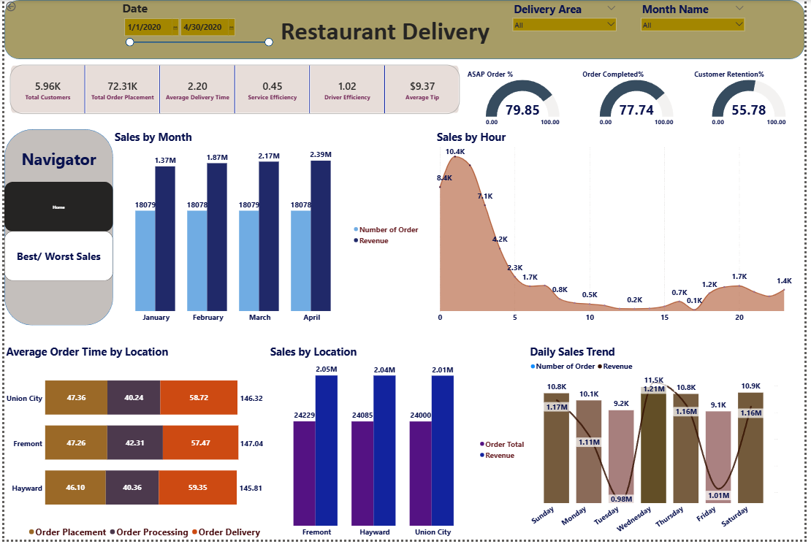
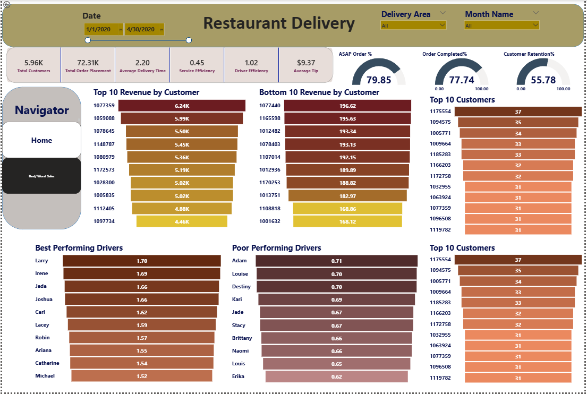

# 🍕 Restaurant Food Delivery Analysis

A Power BI business intelligence project analysing restaurant food delivery operations — covering order fulfilment, delivery performance, driver efficiency, customer retention, and revenue trends across three delivery areas (Fremont, Hayward, Union City) from January to April 2020.

---

## 📁 Repository structure

```
restaurant-food-delivery-analysis/
│
├── README.md
│
├── documentation/
│   ├── 01_Project_Overview.md
│   ├── 02_Business_Requirements.md
│   ├── 03_Data_Preparation.md
│   ├── 04_Data_Model.md
│   ├── 05_DAX_Measures.md
│   ├── 06_Dashboard_Explanation.md
│   ├── 07_Business_Insights.md
│   └── 08_Recommendations.md
│
├── powerbi/
│   └── Restaurant_Food_Delivery_Analysis.pbix
│
├── screenshots/
│   ├── dashboard_page_1.png
│   └── dashboard_page_2.png
│
└── data/
```

---

## 📊 Dashboard preview

### Page 1 — Home (Operations & Revenue)


### Page 2 — Best / Worst Sales


---

## 🔑 Key metrics

| Metric | Value |
|--------|-------|
| Total customers | 5.96K |
| Total orders | 72.31K |
| Average delivery time | 2.20 hrs |
| Service efficiency | 0.45 orders/hr |
| Driver efficiency | 1.02 deliveries/hr |
| Average tip | $9.37 |
| ASAP order % | 79.85% |
| Order completion % | 77.74% |
| Customer retention % | 55.78% |

---

## 📈 Highlights

- **Revenue grew 74%** from January ($1.37M) to April ($2.39M) with consistent order volumes — average order value is rising
- **Overnight peak demand** — highest order volumes at 1 AM (10.4K orders) and 2 AM (8.4K orders), not dinner time
- **Fremont** leads on order volume (24,229) while **Hayward** leads on revenue ($2.04M) — higher spend per order
- **Top driver Larry** completes 1.70 deliveries/hr vs bottom driver **Erika** at 0.62 — a 2.7× efficiency gap
- **Top customer #1077359** generated $6.24K in revenue across the period
- **Wednesday** is the busiest day (11.5K orders, $1.21M revenue); **Tuesday** and **Friday** are the quietest

---

## 🗂️ Dashboard pages

### Page 1 — Home
Covers overall operational and revenue performance:
- KPI cards: Total Customers, Total Orders, Avg Delivery Time, Service Efficiency, Driver Efficiency, Avg Tip
- Gauge charts: ASAP Order %, Order Completed %, Customer Retention %
- Sales by Month (revenue + order count)
- Sales by Hour (order volume trend throughout the day)
- Average Order Time by Location (placement, processing, delivery breakdown)
- Sales by Location (revenue + orders per area)
- Daily Sales Trend (revenue + orders by day of week)

### Page 2 — Best / Worst Sales
Covers customer value and driver performance:
- Top 10 Revenue by Customer
- Bottom 10 Revenue by Customer
- Top 10 Customers by order count
- Best Performing Drivers (by deliveries/hr)
- Poor Performing Drivers (by deliveries/hr)

---

## 🛠️ Tools used

| Tool | Purpose |
|------|---------|
| Power BI Desktop | Data modelling and dashboard |
| DAX | 23 calculated measures |
| Power Query (M) | Data ingestion and transformation |
| GitHub | Version control and documentation |

---

## 📄 Documentation

Full documentation is in the [`documentation/`](documentation/) folder:

| File | Contents |
|------|----------|
| [01 Project Overview](documentation/01_Project_Overview.md) | Background, objectives, scope, timeline |
| [02 Business Requirements](documentation/02_Business_Requirements.md) | Stakeholder questions, KPIs, filtering requirements |
| [03 Data Preparation](documentation/03_Data_Preparation.md) | Source tables, Power Query transformations |
| [04 Data Model](documentation/04_Data_Model.md) | Star schema, table schemas, relationships |
| [05 DAX Measures](documentation/05_DAX_Measures.md) | All 23 measures with DAX code and explanations |
| [06 Dashboard Explanation](documentation/06_Dashboard_Explanation.md) | Page-by-page visual walkthrough |
| [07 Business Insights](documentation/07_Business_Insights.md) | Data-backed findings across revenue, timing, and retention |
| [08 Recommendations](documentation/08_Recommendations.md) | Prioritised business recommendations with supporting data |

---

## 📬 Contact

Feel free to open an issue or submit a pull request for suggestions or improvements.
